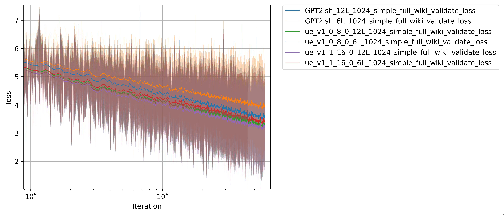
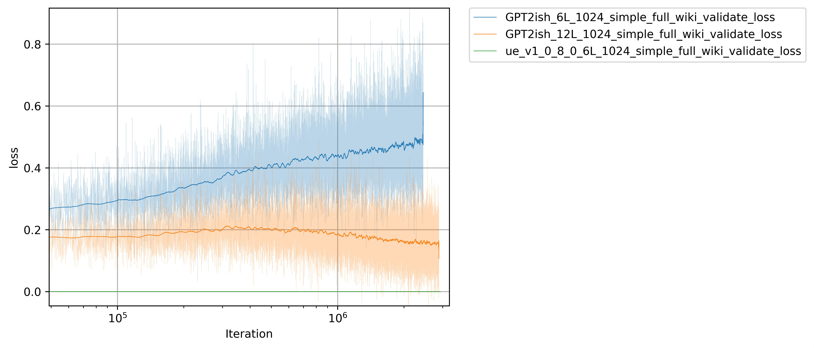
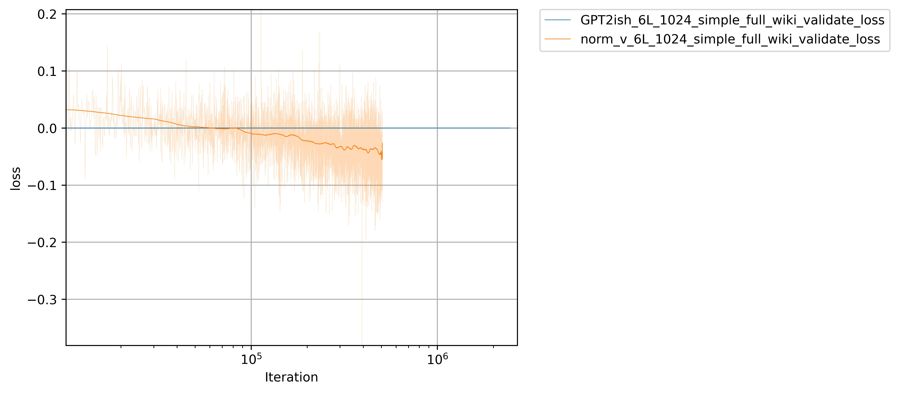
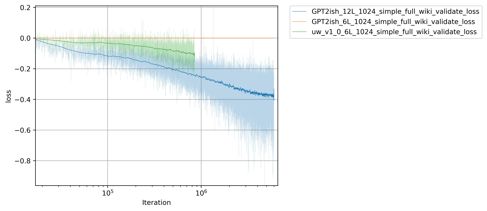

# LMPlay
tldr - Check out the Unified Embeddings experiment.

LMPlay is intended to be a playground to make it easy to try crazy things. It is rough, it is unfinished and, like the best things in life, it is messy.
I have tried to create a structure in this library that makes it easy to try things and compare results.
Everything here is targeted at quick testing and turnaround on commodity hardware. The two primary targets are mac M2 and a NVIDIA 3060 with 12GB ram.
The structure of the project is designed for copy/paste/change, not to provide a stable prod library. Most of the training code has been extracted but the model has been left wide open.
That being said, the training has been designed to be simple. No multi-gpu, multi-process, etc, so hopefully it is a very accessible project for other to try things in.

A note of caution here, because this is a playground the code here will likely change. That means that while you can import this in and use the classes, there is basically no guarantee that updates to this codebase won't badly break your code. Backward compatability is a very low priority compared to creating and comparing experiments. That being said, as results are posted I am trying to make `lmplay.modules` a one stop location to import useful, partially stable, classes. 

## The experiments
I have been playing with ideas 'on the side' for a while now and several show promise. The first one is something I call 'Unified Embeddings'.
### Experiment 1: Unified Embeddings (lmp_trainer --amp --device cuda --exp ue8x/ lmp_trainer  --amp --device cuda --exp ue16x)
#### Some UE results

This graph shows a 6 layer UE model beating a 12 layer baseline model, at least in initial training. The long term benefits are still unknown but these results are promising. The 6 layer UE model here has exactly the same prod inference costs/structure/weights/etc as a baseline 6 layer GPTish model. Only during training does it need extra logic/parameters. Additionally, the larger the UE the better. UE at 16x 1_1 is clearly beating UE 1_0 at 8x. and UEs with more layers maintain solid gains as well.
The diff plot shows performance better:

Here you can clearly see how much better the 6 layer UE models are over the 6 and 12 layer baseline models. It is still gaining ground on the 6 and even the 12 layer looks like the gap may be widening. Additionally, it is easy to see how much better the UE 1_1 is. Saturation hasn't hit for any of the models so longer training is needed but initial training against a moderate dataset (all of wikipedia) clearly shows large gains.

#### UE Overview
Unified Embeddings provide a better way to train embeddings with no additional inference costs or model structure changes however there is a training memory penalty.
The basic idea is to use a very large training embedding and run it through a ff layer to generate the output embedding during training. 
For production inference all vocab embeddings should be pre-generated and stored and the embedding training weights can be tossed. The model will do this with the 'for_prod=True' parameter set. Similarly, if an existing well trained model is modified to replace normal embeddings with a unified embedding class then on weight load it will train a set of training embeddings to then learn from. In testing, with the right control of learning rate, a model can switch to unfied embeddings quickly and start getting gains but in general it is best to start training with them instead of 'bolting them on' after. 
The limited testing I have done so far looks quite promising. So far all training shows this approach is far superior to normal embeddings but some interesting findings have come out:
- Larger is better but more layers can use larger embeddings more than small ones - I tested 8x and 16x sizes and the 16x UEs were superior in the test 6L model at all times however, as training progressed it appeared that the gap between 8x and 16x closed. When the same tests were done with 12 layer modes the gap did not close. 
- 'bolt on' logic appears to be effective but overfit happens exceptionally quick - In limited testing with a modified TinyLlama checkpoint, the v1.0 'bolt on' logic allowed the model to train with UEs quickly and to catch up to an unmodified model with just a few thousand examples. However, when multiple training epochs were used the UE modified model overfit immediately on the second epoch and started to quickly loose any advantage. This was an extremely limited test and I haven't published the results so take this with a grain of salt but it is promising that there may be a path to adding UEs to existing models to get a training boost. Of course just training with them from the start is clearly the best option. I hope to further test with TinyLlama and show a version trained against a larger dataset that clearly outperforms the baseline. When that happens I will post the results.

#### Try it!
```
#Replace your boring regular embeddings with unified ones!
#Other than construction, it is a drop-in replacement

#Sad old embeddings version:
from torch import nn
self.tok_embed = nn.Embedding(vocab_size, embed_dim)

#Exciting Unified Embeddings version!
from lmplay.modules import UnifiedEmbedding
#8.0 is a good place to start. Larger is better! See lmplay.exp.unified_embeddings_v1_0.model for more
self.tok_embed = UnifiedEmbedding(vocab_size, embed_dim, 8.0)
```

#### UE 1.1
UE 1.1 is identical to 1.0 but maintains the training embeddings and first integration linear on CPU to save memory. This allows for exceptionally large training embeddings with a reasonable performance hit. Performance impacts are mitigated by pooling the embedding lookup for the entire batch then doing the first integration on it and only then tranferring the result to the GPU so it can scatter them back to re-create the full batch sequence. This significantly reduces the memory transfer and compute costs especially as batch size grows. Other performance approaches could be taken like embedding caching on the GPU but for the purposes of these initial tests this CPU offload is sufficient to allow testing larger training embeddings. In testing with a batch size of 25 the performance hit was about 40% on a 16x embedding which isn't great, but for the memory saved it was totally worth it.

#### UE 2.0
I built a 2.0, it isn't as good. It is in there to remind me of my failures. Take a look! When you run it you will initially think it is great, but then very quickly it starts to lag behind v1.0.

### Experiment 2: Value Norm (lmp_trainer --amp --device cuda --exp normv)
#### Some norm v results

This clearly shows a reasonable gain that adding layernorm to the value projection provides. The 12 layer baseline is shown to give an idea of the scale of the improvement. It isn't huge, but it is nearly free in compute/memory cost.

#### Norm V overview
Attn is amazing, but there may be simple improvements that can make it even better. One area to consider is the value projection. The value projection applies to all elements of a sequence and softmax sums them all together depending on how k&q rank them in order to get the final value. 
The value projection has a hard job, it not only needs to create a useful value but it needs to avoid making uninteresting values accidentally large which would negate the ranking that the k&q came up with. There is a simple way to take this side-job away from the v projection, use LayerNorm. Now the v projection can focus on emphasizing important value aspects of the sequence and not accidentally destroy the ranking.

At least that is the theory/idea that led me to test it. The results are pretty clear though. While not as large an impact as UEs, adding a simple layer norm is an almost no cost change to multi-head attn and it looks like it provides solid value, at least in early training. Adding layer norm to k or q however appears to have a negative impact (not shown).

#### Try it!
Check out `lmplay.modules.MultiheadAttn` and `lmplay.exp.normv.modules.Block`!


### Experiment 3: Unified Weights
#### Some UW results

This graph shows the impact of UWs. While not as large a gain as UEs, it is clearly significant. 
#### UW overview
UWs are part of a theme. Predicting parameters at training to get better/faster results and then converting a model for prod inference to save memory/compute. Like UEs, UWs only have costs during training and can be re-saved to have the exact same costs/structure/etc as a normal set of weights. However, UWs (at least v1.0) have very little addition training memory/compute requirements. Additionally, they can be bolted onto an existing model without a 'training' step. I haven't bolted them onto a well trained model yet so it is just speculation now but I should have some results soon showing this approach.

So, what is the idea behind them? When thinking about a linear layer I realized that often an output just needs to be bigger. For that behavior to be learned the weights have to increase all parameter values evenly, but gradient updates don't provide a simple one stop parameter to do this. To get around this I created three extra parameters, the 'mbias', the 'mbias_bias' and the 'bias_bias'. With these new parameters in place the code inside of a linear now looks like:
```
  def __init__(...)
    ...
    self.weight = nn.Parameter(torch.empty((out_features, in_features), **factory_kwargs))
    self.bias = nn.Parameter(torch.empty(out_features, **factory_kwargs))
    self.mbias = nn.Parameter(torch.ones(out_features, **factory_kwargs))
    self.mbias_bias = nn.Parameter(torch.zeros(1, **factory_kwargs))
    self.bias_bias = nn.Parameter(torch.zeros(1, **factory_kwargs))
    ...
    
  def forward(self, input: torch.Tensor) -> torch.Tensor:
    result = F.linear(input, self.weight, None)
    result = result * (self.mbias + self.mbias_bias) + (self.bias + self.bias_bias)
```
Clearly this is equivalent to a standard linear layer right? Yes, technically, but now we have some simple parameters for gradients to easily act on that unifi all parameters in the linear layer. The main weights now can completely focus on deviations from 0 since the mbias weights allow them to normalize. Taking the idea slightly further I aded the 'mbias_bias' and 'bias_bias' to allow the bias and mbias to also focus on just the deviations from zero. In the end the only weights that may need to go to extremes here are the mbias_bias and the bias_bias. All other weight should be able to stay close to 0 with little effort. I haven't tried it yet but this new Linear formulation should be especially well suited to weight decay so long as the mbias_bias and the bias_bias are excluded from that. 

#### Try it!
```
#Replace your boring regular nn.Linear with unified ones!
#Other than construction, it is a drop-in replacement

#Sad old standard version:
from torch import nn
l1 = nn.Linear(in_size, out_size)

#Exciting unified version!
from lmplay.modules import ULinear
l1 = ULinear(in_size, out_size)
```


#### UW 2.0
I built a 2.0 version. It takes the meta idea further and predicts the bias instead of adding the mbias. It works but is very expensive. I suspect there is a lot that can be done here to improve on this idea but for now I don't intend to pursue it further.  
## Future experiments
I am slowly 'cleaning up' many projects that I have been working on and intend to release them as I have longer training runs on them. I am currently limited to my one 3060 so even these limited runs take several days each. In fact, one epoch on the dataset in use will take roughly 10 days per model to complete. 

I picked UEs and value norm first since they are very easy to understand and implement. I am planning on releasing one every couple weeks for the next couple months.

## Experiment details
Unless otherwise stated experiments are run using the Adagrad optimizer with a batch size of 50, fixed lr of 0.0006 and no weight decay. Training is all done single GPU with --amp enabled. Mini-batch sizes are generally either 4, 10 or 25 depending on the GPU available and the test being run but quick tests show no significant deviation in results with different mini-batch sizes. --amp does have a minor, but noticable, impact but the performance gains make it a requirement and the impacts are much smaller than the gap between experiment results and baseline results. The data set is a two stage curriculum consisting of the 'simple' wikipedia dataset followed by the full 'en' dataset (https://huggingface.co/datasets/wikipedia, https://dumps.wikimedia.org). Both are re-split with a fixed seed to create train/validate datasets. I did not dig to figure out if the simple dataset had crossover with the full dataset so there may be contamination however, all models, including the baselines, have had the exact same train/validation splits so if there is contamination it shouldn't have a preferential effect on the experiments.   

## GPT2ish (lmp_trainer --exp gpt2ish)
The baseline encoder I am using as the reference model is based on GPT2. Any flaws in it are my own and you shouldn't take this as reference code for a GPT2 implementation.

## Baseline transformer code
The basic transformer encoder block is a very simple implementation that makes testing new ideas easy, but shouldn't be considered prod ready or appropriate code. It is however simple enough to make it easy to see what goes on inside of a basic transformer block. 

## Model weights / repeatability
I currently don't have plans to release trained model weights. The models here aren't well trained enough to really matter and the weights can all be re-created by running the experiments for a few days on a commodity GPU. If someone -really- wants the weights then please contact me and I will consider releasing the weights of a given experiment.

## Code/idea attribution
If you end up using any of the experiment ideas in this repo please attribute me and this repo. I would like to work on a more academic writeup of the ideas in here, but for now I am just getting things built and playing.   

## Project structure
### lmp_trainer
The training loop is implemented in `lmplay.train.__main__`. At the top are two imported `ModelRunner` classes. One is for the baseline transformer encoder model that is 'GPT2ish' in design. 
The other points to one of the experiments. Experiments are generaly cut/paste/modify from the base encoder model and this is by design. 
This style leads to a lot of copied code, but it also leads to readability, simple testing and avoids issues where code changes in an experiment impact other experiments. I based this repo off of an internal one I use and I have found that this structure has allowed for rapid testing of new ideas.

### lmp_generator
This is a very basic inference engine with the absolute minimum code needed to take a trained model ang generate results from it. Performance is a distant thought in this code.
The code is implemented in `lmplay.generate.__main__`

### lmp_plotstats
It is all about the graphs right? This will take outputs from different runs and put them all in the same plot files. Two basic stats are plotted, accuracy and loss. 
For each of these there are two different kinds of graphs, a regular log plot and a 'diff' plot where the longest run is used as the baseline for the other runs. This diff view makes it much easier to compare the performance of different models/runs.
The code is implemented in `lmplay.stats.__main__`. It is messy and does some bad math to make things look prettier so this is likely to change a bit in the future.

## Usage
```
#All reported experiments had --amp turned on for speed. If you aren't on NVIDA leave it off. Results will be nearly the same.
#To train the baseline 6L GPT2ish model
lmp_trainer --amp --device cuda

#To train one of the experiments
lmp_trainer --amp --device cuda --exp <exp name>

#To list the experiments
lmp_trainer --amp --device cuda --exp list
```
That's it! it will download datasets and start training. Check `--help` for other options like device, mini-batch-size, etc etc.

## Contribution
At the moment I am doing this mainly for myself but I am open to considering outside contributions, especially ones with GPU resources!
